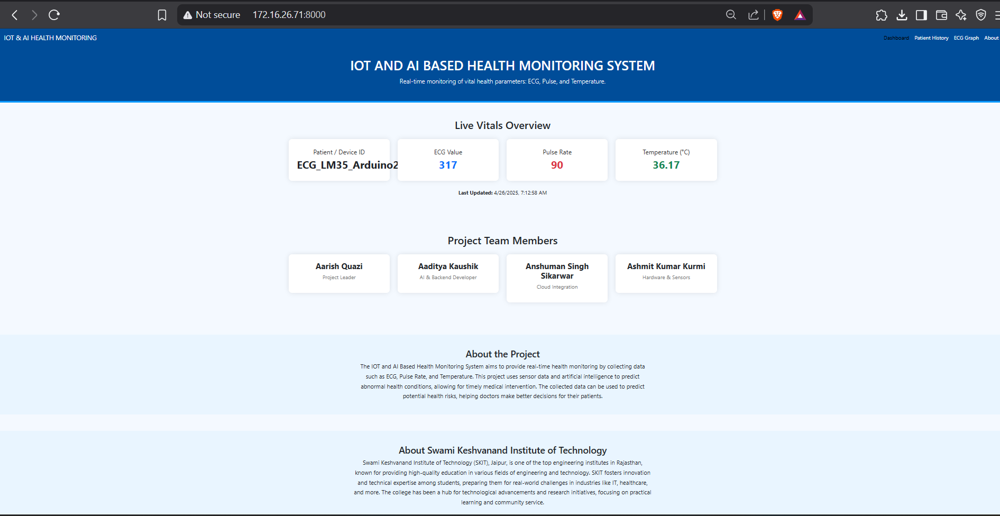
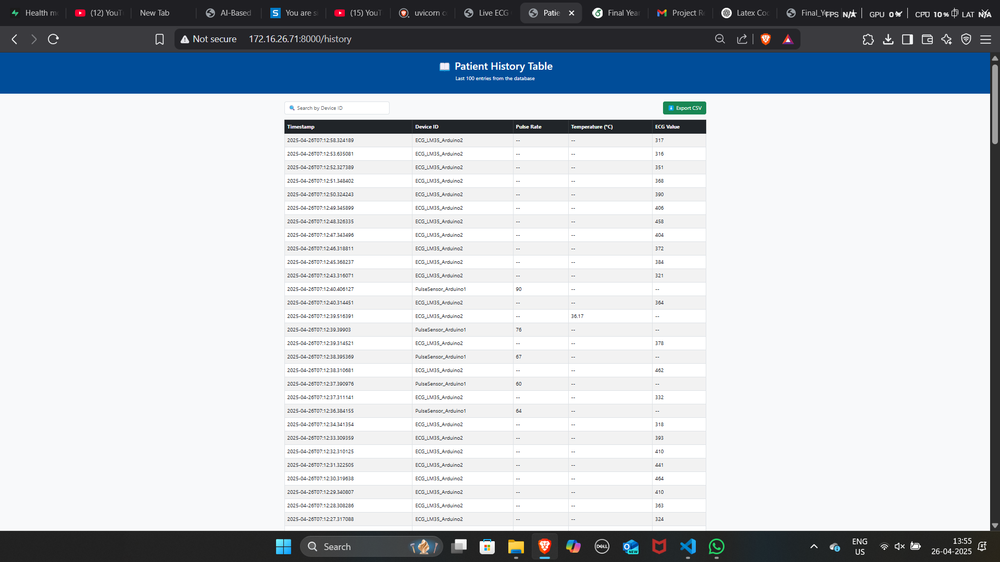
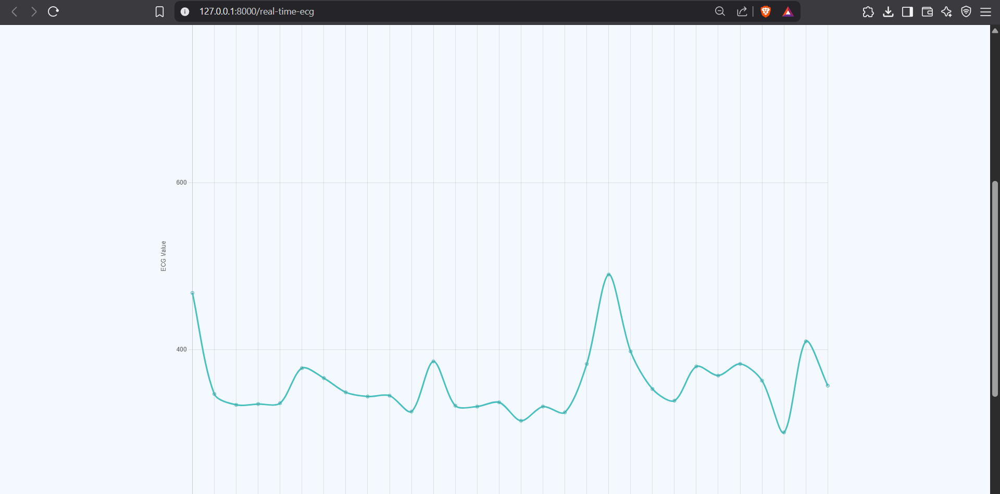
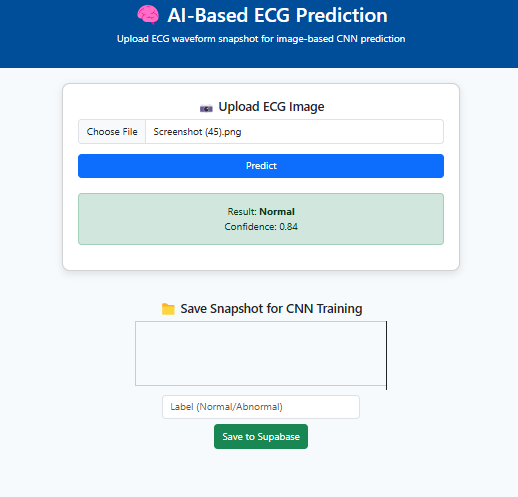
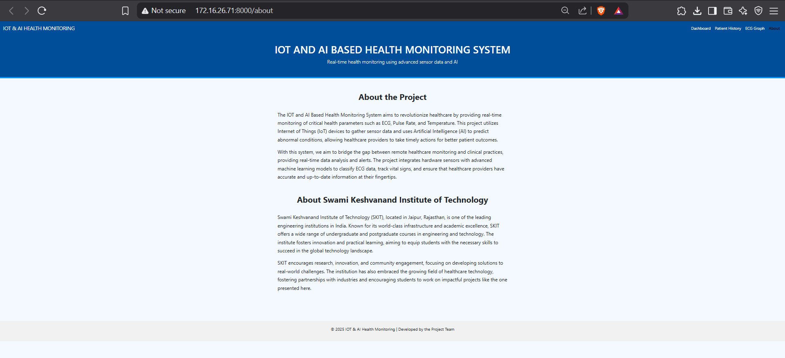

# IOT AND AI BASED HEALTH MONITORING SYSTEM 🚑🧠

Welcome to the **IoT and AI-based Health Monitoring System** repository!  
This project integrates IoT sensors with AI models to provide real-time monitoring and predictive analysis for heart health.

---

## 📚 Project Overview

This system monitors key health metrics like:
- Heart Rate ❤️
- Temperature Sensor (LM35) 🌡️
- Live ECG Plots 📈
- AI-based Heart Disease Prediction 🧠

It connects hardware sensors to a web dashboard and a cloud database, providing **live** and **historical** data for better health insights.

---

## 🛠️ Tech Stack

- **IoT Hardware**: Arduino Uno + MAX30102 + AD8232 ECG Sensor
- **Frontend**: HTML5, CSS3, JavaScript, React.js
- **Backend**: Node.js, Firebase / Supabase
- **Database**: Supabase Cloud (PostgreSQL based)
- **AI Model**: Trained Deep Learning model for ECG classification
- **Deployment**: GitHub + Cloud Hosting

---

## 📸 Screenshots

| Real Time Dashboard | Patient History |
| :-----------------: | :--------------: |
|  |  |

| Live ECG Plot | Prediction Page |
| :-----------: | :--------------: |
|  |  |

| About Page | Supabase Cloud Database |
| :--------: | :----------------------: |
|  |  |

---

## 🚀 Features

- Real-time health monitoring
- AI-based predictive analysis
- Cloud database storage and retrieval
- User-friendly dashboard and live ECG visualization
- Patient health history tracking

---

## 📂 Project Structure

```bash
├── project/
│   ├── images/         # Screenshots & ECG images
├── ECG Model/             # AI Models and Scripts
├── Arduino Code/       # Arduino programs for sensors
├── Sensor Data Superbase Upload/       # Arduino data upload to superbase cloud
├── Web Dash/       # Web dashboard for real time health monitoring and prediction
├── README.md           # You're here
├── .gitignore
